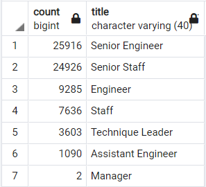
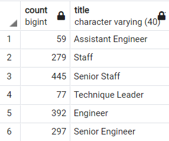

# Pewlett-Hackard Retirement Analysis

## Overview
We were tasked with translating Pewlett-Hackard's six CSV files containing all their employees to a SQL database, from which we then investigated and tabulated employees at or approaching retirement age.  For our purposes, employees approaching retirement were born between 1952 and 1955.  Then we looked at employees born in 1965 who may be eligible for a new mentorship program PH is considering.

## Results

### Retiring Employees
The full list of employees approaching retirement can be found in [unique_titles.csv](Data/unique_titles.csv).  Many of these employees have filled multiple roles at PH over the years, and their complete company history can be found in [retirement_titles.csv](Data/retirement_titles.csv).  Some key takeaways from this project are:
* 72,458 employees are predicted to retire in the next three years.
* The number of employees leaving by title is shown in the table below, also found in [retiring_titles.csv](Data/retiring_titles.csv):

    

  * Two (2) managers are of retirement age.
  * 50,842, which is just over 70%, of the retiring employees are senior level staff and engineers.
### Mentorship Program
To help ease the transition as so many employees retire, Pewlett-Hackard is considering launching a mentorship program, where retiring employees will shift out of their regular tasks and begin training new employees to fill their shoes.  To begin with, we looked at employees born in 1965, listed in [mentorship_eligibility.csv](Data/mentorship_eligibility.csv).  The number of eligible mentors by department are listed below:



* 1,549 employees are eligible under current criteria.
* This is about 2% of the number of retirees.
  * The eligible Senior Engineer mentors amount to only 1.1% of the retiring Senior Engineers.
  * Each mentor would need to mentor 47 employees to account for all retirees, more if the company is still expanding during this time.

## Summary
<!-- Provide high-level responses to the following questions, then provide two additional queries or tables that may provide more insight into the upcoming "silver tsunami."

    How many roles will need to be filled as the "silver tsunami" begins to make an impact?  72,458 retiring, more if PH wants to continue to expand
    Are there enough qualified, retirement-ready employees in the departments to mentor the next generation of Pewlett Hackard employees?  not with the current criteria for mentorship eligibility

-->
As this so-called "silver tsunami" approaches, Pewlett-Hackard will have 72,458 positions to fill to replace the retirees, or more if the company is to expand during this time.  With our current mentorship criteria, those employees born in 1965, there are not nearly enough eligible mentors to train the next generation.  I would recommend shifting away from age as a determining factor for mentorship positions, and rather turn my attention to tenure or performance.

### Further Analysis
We have looked at the number of employees retiring by title, but it would also be useful to look at those numbers by department.  I imagine a Customer Service Engineer and a Development Engineer would have distinct responsibilities.  We can do so using the code below, which yields the [retiring_dept_titles](Data/retiring_dept_titles.csv) table.

<!-- code to create table retiring_dept_titles.csv showing how many employees with each title are retiring from each department, to know where to focus hiring efforts -->
``` SQL
SELECT 	COUNT(ut.emp_no),
		d.dept_name,
		ut.title
INTO retiring_dept_titles
FROM unique_titles ut
INNER JOIN dept_emp de
	ON (ut.emp_no = de.emp_no)
INNER JOIN departments d
	ON (de.dept_no = d.dept_no)
GROUP BY (d.dept_name, ut.title)
ORDER BY d.dept_name;
```

This query can easily be modified to do the same for [eligible mentors](Data/mentor_dept_titles.csv), by calling on the mentorship_eligibility table instead of the unique_titles table.
<!-- can do something very similar with mentorship_eligibility to get mentor_dept_titles.csv, simply replacing unique_titles with mentorship_eligibility -->
